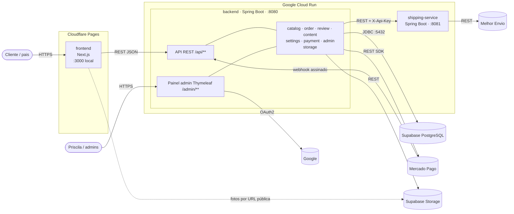
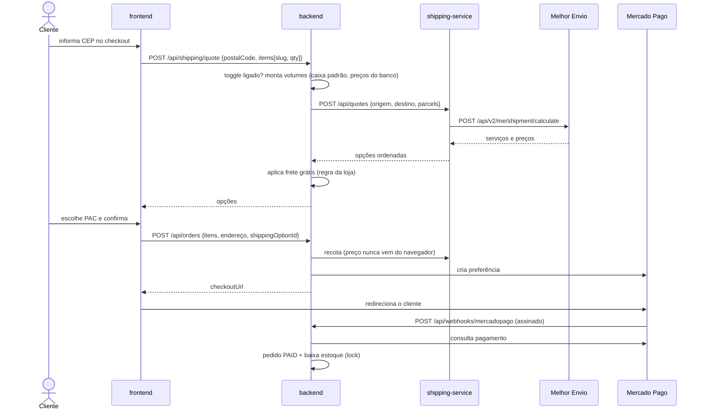
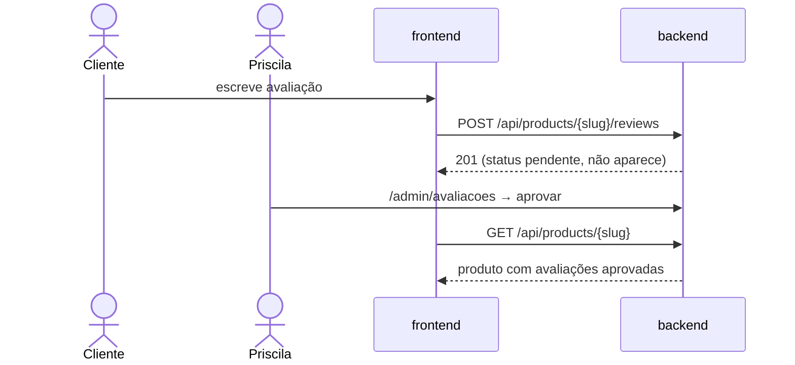
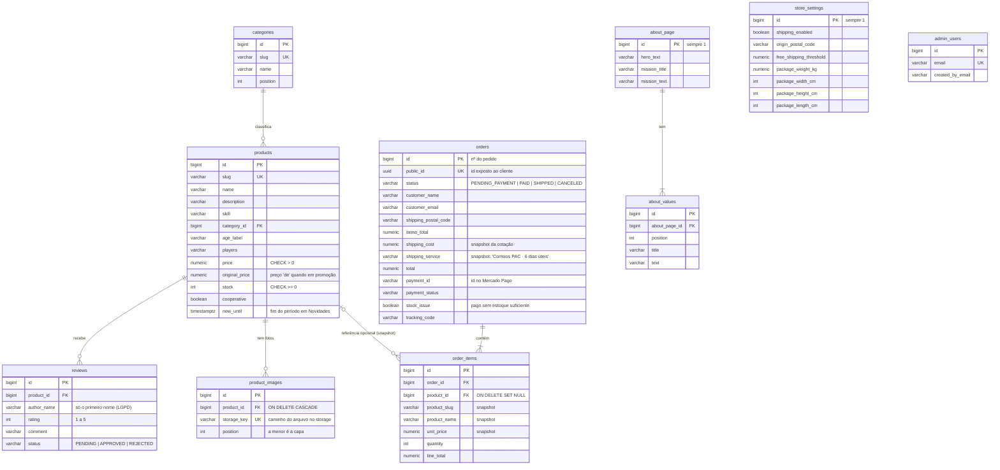
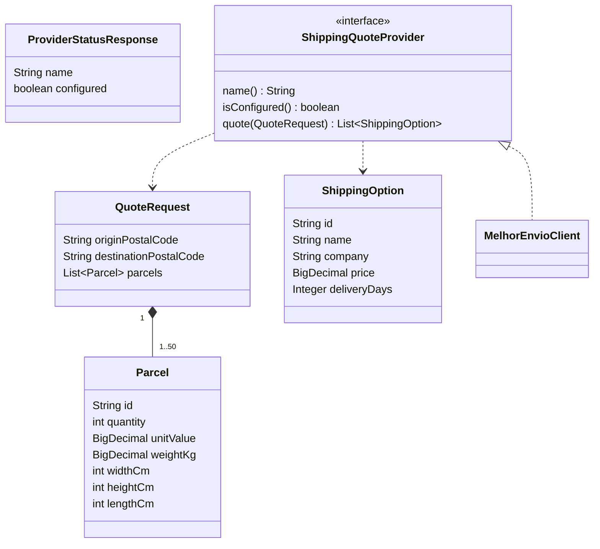
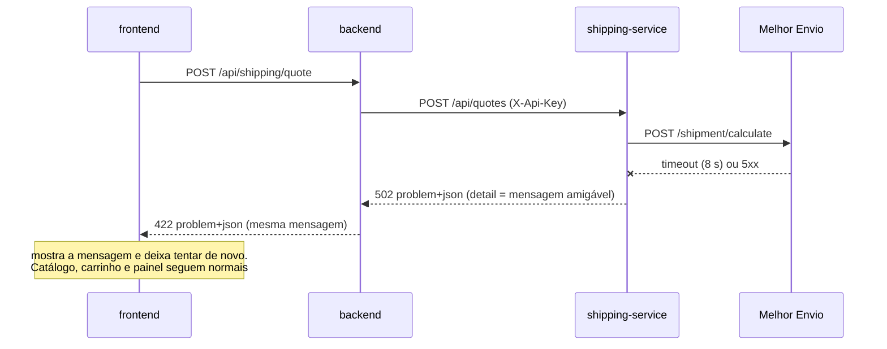
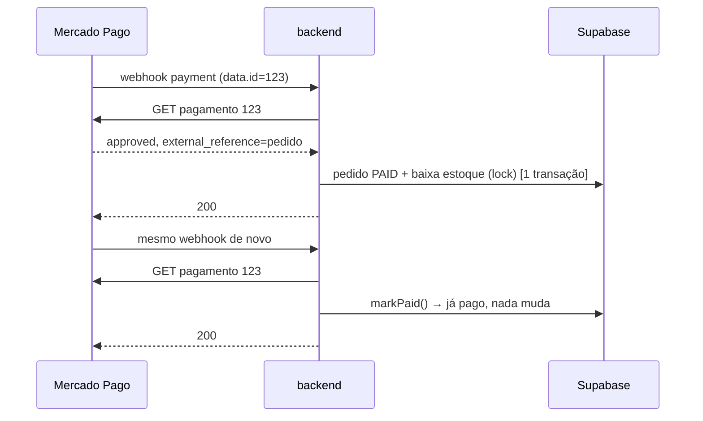
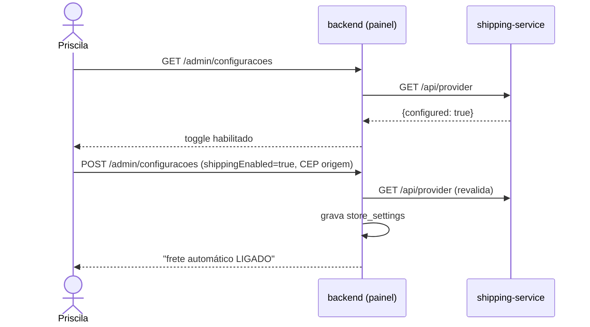

# ASOBI: análise da solução e decomposição em serviços

Este documento parte do problema que a loja resolve e chega até os serviços que a compõem. Segue a cadeia
**necessidade → requisito → funcionalidade → processo → domínio → serviço → dados → contratos → fluxos**,
e cada decisão de decomposição vem com a sua justificativa.

Detalhes de execução e deploy ficam em [backend/README.md](../backend/README.md) e
[shipping-service/README.md](../shipping-service/README.md).

---

## 1. Contexto e intervenção

**Problema.** Uma pequena empresária (a Priscila) quer vender jogos de tabuleiro infantis pela internet.
Ela não tem equipe técnica, o orçamento de infraestrutura é praticamente zero (bem abaixo de R$ 110/mês) e o
público final envolve crianças, o que exige cuidado extra com conteúdo e dados (LGPD, art. 14).

**Intervenção definida.** Um e-commerce próprio, a **ASOBI**, com:

- loja virtual pensada para pais escolherem jogos pela idade da criança;
- checkout com pagamento terceirizado (Mercado Pago), sem guardar dados de cartão;
- **painel administrativo** que dá à Priscila controle total do site sem depender de programador;
- somente **serviços gerenciados em tier gratuito** (Cloudflare Pages, Google Cloud Run, Supabase), sem
  servidor próprio para manter.

---

## 2. Necessidades

| ID | Necessidade | Quem sente |
|---|---|---|
| N1 | Vender pela internet recebendo por Pix, cartão e boleto, com segurança | Priscila / cliente |
| N2 | Encontrar rápido jogos adequados à idade e ao perfil da criança | Cliente (pais) |
| N3 | Operar a loja sozinha no dia a dia (produtos, preços, promoções, novidades, textos) | Priscila |
| N4 | Custo mensal de infraestrutura próximo de zero | Priscila |
| N5 | Proteger o público infantil: nada publicado sem moderação e dados mínimos | Priscila / famílias |
| N6 | Saber o custo e o prazo da entrega antes de pagar, e poder desligar isso | Cliente / Priscila |
| N7 | Não vender o que não tem em estoque e acompanhar cada pedido até o envio | Priscila |
| N8 | Acesso administrativo seguro e que possa ser delegado a outras pessoas | Priscila |

---

## 3. Requisitos

### Funcionais

| ID | Requisito | Necessidades |
|---|---|---|
| RF01 | Listar o catálogo filtrando por faixa etária e por estilo (cooperativo) | N2 |
| RF02 | Exibir a ficha do produto: fotos, descrição, idade, nº de jogadores, preço/promoção, habilidade estimulada | N2 |
| RF03 | Manter um carrinho de compras | N1 |
| RF04 | Fechar o pedido sem cadastro, com preço e estoque calculados no servidor | N1, N7 |
| RF05 | Cobrar via Mercado Pago Checkout Pro e confirmar o pagamento por webhook assinado | N1 |
| RF06 | Permitir ao cliente acompanhar o status do pedido | N7 |
| RF07 | Cotar o frete por CEP, com liga/desliga no painel e frete grátis acima de um valor | N6, N3 |
| RF08 | Receber avaliações de clientes, visíveis somente após aprovação do admin | N5 |
| RF09 | CRUD de produtos e faixas etárias, controle de estoque e de promoção | N3, N7 |
| RF10 | Definir por quanto tempo um produto fica em "Novidades" e ver quanto falta | N3 |
| RF11 | Editar a página "Sobre" pelo painel | N3 |
| RF12 | Adicionar e remover e-mails de administradores pelo painel | N8 |
| RF13 | Gerenciar pedidos: marcar como pago (modo manual), enviado ou cancelado | N7 |
| RF14 | Entrar no painel com conta Google autorizada pela lista de admins | N8 |
| RF15 | *(Fase 2)* Dashboard com faturamento, pedidos e visualizações por produto | N3 |

### Não funcionais

| ID | Requisito | Necessidades |
|---|---|---|
| RNF01 | Custo ≈ R$ 0/mês usando tiers gratuitos; serviços escalam a zero | N4 |
| RNF02 | Apenas serviços gerenciados (nada de VPS ou servidor próprio) | N3, N4 |
| RNF03 | Backend em Java 17 / Spring Boot (exigência acadêmica) | — |
| RNF04 | Nunca armazenar dados de cartão (pagamento 100% no Mercado Pago) | N1 |
| RNF05 | LGPD: coletar só dados do responsável adulto, nada da criança | N5 |
| RNF06 | Falha de API externa (frete) não pode derrubar a loja nem o checkout | N1, N6 |
| RNF07 | Integrações externas substituíveis sem mexer no núcleo da loja | N3, N6 |
| RNF08 | Rotas públicas em português (SEO) e visual lúdico | N2 |

---

## 4. Funcionalidades

| ID | Funcionalidade | Onde | Requisitos |
|---|---|---|---|
| F01 | Catálogo com filtros por idade/estilo | Loja `/jogos` · `GET /api/products` | RF01 |
| F02 | Ficha de produto + relacionados | Loja `/jogos/[slug]` · `GET /api/products/{slug}` | RF02 |
| F03 | Vitrines de Novidades e Promoções | Loja `/novidades`, `/promocoes` | RF01, RF10 |
| F04 | Carrinho | Loja `/carrinho` | RF03 |
| F05 | Cotação de frete no checkout | `POST /api/shipping/quote` → **shipping-service** | RF07 |
| F06 | Checkout sem cadastro | `POST /api/orders` | RF04 |
| F07 | Pagamento e confirmação | Mercado Pago + `POST /api/webhooks/mercadopago` | RF05 |
| F08 | Acompanhar pedido | Loja `/pedido/[id]` · `GET /api/orders/{id}` | RF06 |
| F09 | Enviar avaliação | `POST /api/products/{slug}/reviews` | RF08 |
| F10 | Fila de moderação | Painel `/admin/avaliacoes` | RF08 |
| F11 | Gestão de produtos, estoque, promoção e novidades | Painel `/admin/produtos` | RF09, RF10 |
| F12 | Gestão de faixas etárias | Painel `/admin/categorias` | RF09 |
| F13 | Editor da página Sobre | Painel `/admin/sobre` · `GET /api/content/about` | RF11 |
| F14 | Gestão de admins | Painel `/admin/admins` | RF12 |
| F15 | Gestão de pedidos | Painel `/admin/pedidos` | RF13 |
| F16 | Configurações da loja (liga/desliga frete, frete grátis, caixa padrão) | Painel `/admin/configuracoes` | RF07 |
| F17 | Login do painel com Google | Painel `/admin/login` | RF14 |

---

## 5. Processos de negócio

| ID | Processo | Atores | Passos principais |
|---|---|---|---|
| P1 | **Compra** | Cliente, loja, backend, shipping-service, Mercado Pago | navegar → carrinho → informar CEP e cotar frete → preencher dados → criar pedido (preço, estoque e frete recalculados no servidor) → redirecionar ao Mercado Pago |
| P2 | **Confirmação de pagamento** | Mercado Pago, backend | webhook assinado → backend **reconsulta** o pagamento na API → pedido `PAID` → baixa de estoque com lock na linha do produto (uma única vez) |
| P3 | **Expedição** | Priscila | ver pedidos pagos → enviar → marcar `SHIPPED` (ou cancelar) |
| P4 | **Moderação de avaliações** | Cliente, Priscila | cliente envia (entra `pendente`) → Priscila aprova ou rejeita → só aprovadas aparecem na ficha |
| P5 | **Gestão de catálogo** | Priscila | cadastrar/editar produto → definir estoque, promoção e dias em Novidades → loja reflete na hora |
| P6 | **Gestão de conteúdo** | Priscila | editar história, valores e missão da página Sobre |
| P7 | **Gestão de acesso** | Admin | login Google → e-mail conferido em `admin_users` a cada requisição → adicionar/remover admins |
| P8 | **Configuração de frete** | Priscila | ligar o frete automático (só se o shipping-service estiver no ar e com token) → definir CEP de origem, caixa padrão e valor de frete grátis |

Ciclo de vida do pedido: `PENDING_PAYMENT → PAID → SHIPPED`, com `CANCELED` possível antes do envio.

---

## 6. Domínios de negócio

Classificação segundo o DDD: *core* é o diferencial do negócio, *supporting* é necessário mas específico
da loja, e *generic* é um problema comum que pode ser terceirizado.

| Domínio | Tipo | Responsabilidade | Dados (tabelas) |
|---|---|---|---|
| **catalog** | core | Produtos, faixas etárias, preço/promoção, estoque, período de Novidades | `products`, `categories` |
| **order** | core | Pedido, itens, cliente/endereço, status, total calculado no servidor | `orders`, `order_items` |
| **review** | supporting | Avaliações e sua moderação | `reviews` |
| **content** | supporting | Conteúdo institucional (página Sobre) | `about_page`, `about_values` |
| **settings** | supporting | Parâmetros da loja (toggle de frete, frete grátis, caixa padrão, CEP de origem) | `store_settings` |
| **shipping** | generic | Cotação de frete na transportadora | nenhum (stateless) |
| **payment** | generic | Cobrança e confirmação via Mercado Pago | nenhum próprio (status fica no pedido) |
| **admin** | generic | Identidade e acesso ao painel | `admin_users`, `spring_session*` |

---

## 7. Rastreabilidade

| Necessidade | Requisitos | Funcionalidades | Domínio | Serviço |
|---|---|---|---|---|
| N1 Vender com segurança | RF03, RF04, RF05, RNF04 | F04, F06, F07 | order, payment | backend + Mercado Pago |
| N2 Achar o jogo certo | RF01, RF02, RNF08 | F01, F02, F03 | catalog | backend + frontend |
| N3 Operar sozinha | RF09, RF10, RF11, RF07 | F11, F12, F13, F16 | catalog, content, settings | backend (painel) |
| N4 Custo ≈ zero | RNF01, RNF02 | — (transversal) | — | todos (Cloud Run a zero, Pages, Supabase free) |
| N5 Proteger crianças | RF08, RNF05 | F09, F10 | review | backend |
| N6 Custo de entrega | RF07, RNF06, RNF07 | F05, F16 | shipping, settings | **shipping-service** + backend |
| N7 Estoque e pedidos | RF04, RF06, RF13 | F06, F08, F15 | order, catalog | backend |
| N8 Acesso seguro | RF12, RF14 | F14, F17 | admin | backend + Google OAuth |

---

## 8. Serviços candidatos

Cada domínio foi avaliado como candidato a serviço independente:

| Candidato | Domínio | Responsabilidade | Decisão | Justificativa |
|---|---|---|---|---|
| **shipping-service** | shipping | Cotar frete na transportadora e normalizar a resposta | ✅ **Extraído** | Integração externa instável e lenta: isolada, uma falha não afeta a loja (RNF06). Sem estado e sem banco. Trocar de transportadora não mexe na loja (RNF07). O token do Melhor Envio fica só nele. |
| catalog-service | catalog | Produtos, estoque, promoção | ⏸ Mantido no backend | A baixa de estoque precisa estar na **mesma transação** da confirmação do pagamento (lock na linha do produto). Separar exigiria saga/compensação, complexidade injustificável para um negócio com uma operadora. |
| order-service | order | Pedidos | ⏸ Mantido no backend | Mesmo motivo acima: pedido + estoque + pagamento formam uma unidade transacional. |
| payment-service | payment | Mercado Pago | ⏸ Mantido no backend | Já é terceirizado (o Mercado Pago é o "serviço"). O módulo local só adapta, atrás da interface `PaymentGateway`. |
| review-moderation-service | review | Filtro de conteúdo antes da fila | 🔜 Candidato futuro | Bom candidato quando houver filtro automático (lista de palavras, IA). Hoje é só CRUD + aprovação. |
| recommendation-service | catalog (leitura) | Sugerir jogos por idade/habilidade | 🔜 Candidato futuro | Só leitura do catálogo; pode consumir a API pública. |
| content / settings / admin | — | Conteúdo, parâmetros e acesso | ⏸ Mantidos | Pouco volume e nenhuma integração externa. Separar só adicionaria custo (cold start, mais conexões no Supabase free). |

**Por que não "um microsserviço por domínio"?** O free tier do Supabase tem poucas conexões (o backend já
usa `maximum-pool-size: 3`). Cada serviço extra no Cloud Run também tem seu próprio *cold start*. E a Priscila
precisa operar sozinha (RNF01, RNF02). A decomposição escolhida é um **backend modular** (fronteiras de
domínio claras em pacotes) + **microsserviços onde há ganho real**. Hoje isso vale para o frete.

---

## 9. Arquitetura distribuída



### Limites de cada serviço

| Serviço | Dono de | **Não** conhece |
|---|---|---|
| **frontend** | Apresentação, carrinho no navegador, rotas públicas em português | Preços "verdadeiros" (sempre vêm da API), segredos |
| **backend** | Regras da loja: catálogo, pedido, estoque, moderação, conteúdo, configurações, acesso; **política** de frete (toggle, frete grátis, caixa padrão) | Qual transportadora é usada e como a API dela funciona |
| **shipping-service** | Integração com a transportadora: autenticação, formato da API, timeout, normalização e ordenação das opções | Produtos, preços de venda, pedidos, toggle, frete grátis, banco de dados |

Não há sobreposição: a regra "frete grátis acima de R$ X" é **comercial** e fica no backend (domínio
`settings`). A regra "como pedir preço ao Melhor Envio" é **técnica/integração** e fica no shipping-service.
O backend recota o frete ao fechar o pedido, de modo que o preço nunca vem do navegador.

---

## 10. Dependências e fluxos de comunicação

### Entre serviços

| De → Para | Protocolo | Por quê | Se falhar |
|---|---|---|---|
| frontend → backend | REST/JSON (CORS) | Única fonte de verdade de preço, estoque e pedidos | Loja sem catálogo e sem checkout |
| backend → shipping-service | REST/JSON + `X-Api-Key` | Cotar frete (F05) e recotar ao fechar pedido | Só a cotação falha (HTTP 422 com mensagem amigável); o resto da loja segue no ar, e a Priscila pode desligar o frete no painel para voltar ao "a combinar" |
| shipping-service → Melhor Envio | REST + Bearer token | Preço e prazo reais | `502` com mensagem amigável (timeout de 8 s) |
| backend → Mercado Pago | REST (SDK) | Criar preferência e consultar pagamento | Modo manual: Priscila confirma no painel |
| Mercado Pago → backend | Webhook assinado (`x-signature`) | Avisar mudança de pagamento | Reconsulta ao cliente voltar (`payment-sync`) |
| backend → Supabase | JDBC (Session pooler) | Persistência | Indisponibilidade da loja |
| backend → Google | OAuth2 / OIDC | Login do painel | Painel inacessível; a loja segue no ar |
| backend → Supabase Storage | REST + chave secreta | Guardar e apagar as fotos de produto (bucket público `product-images`) | O upload falha com mensagem amigável no painel; o produto é salvo sem a foto nova |
| frontend → Supabase Storage | HTTPS (URL pública) | Exibir as fotos sem passar pelo Cloud Run | As fotos não carregam até o storage voltar; o resto da loja segue no ar |

### Fluxo P1 + P2: compra com frete e pagamento



### Fluxo P4: moderação



### Dependências internas do backend (entre módulos)

| Módulo | Depende de | Justificativa |
|---|---|---|
| order | catalog, payment, shipping | Pedido precisa de preço/estoque, cria cobrança e recota frete |
| payment | order | O gateway monta a preferência a partir do pedido; o webhook atualiza o pedido |
| shipping | catalog, settings | Monta os volumes com preço dos produtos e caixa padrão configurada |
| settings | shipping, admin | Só deixa ligar o frete se o provedor estiver configurado; registra qual admin alterou |
| catalog ⇄ review | — | A ficha do produto exibe avaliações aprovadas; a avaliação referencia o produto |
| content | admin | Registra qual admin editou |
| admin | catalog, order, review | Dashboard com contagens de cada domínio |
| catalog | storage | Guarda as fotos dos produtos e monta as URLs públicas |

Ciclos conhecidos que ainda restam: `catalog ⇄ review`, `order ⇄ payment` e `settings ⇄ shipping`. Eles são
tolerados porque ficam **dentro do mesmo deploy**. Na extração do frete, o ciclo `order ⇄ shipping` foi
removido (o endpoint de cotação agora tem DTO próprio) e o `GET /api/settings` passou para o domínio
`settings`. Se algum desses domínios virar serviço, o ciclo vira evento (ex.: `PaymentApproved`) ou uma
interface (porta) no lado dependente.

---

## 11. Modelo de dados por serviço

Cada serviço é dono exclusivo dos seus dados. Nenhum serviço lê ou grava as tabelas de outro.

### 11.1 backend: Supabase PostgreSQL (esquema `public`)

Esquema versionado pelo Flyway (`backend/src/main/resources/db/migration`). Cada tabela pertence a **um**
módulo de domínio, e só esse módulo tem o repositório JPA que a acessa.



| Módulo (domínio) | Tabelas de que é dono | Entidades JPA |
|---|---|---|
| catalog | `categories`, `products`, `product_images` | `Category`, `Product`, `ProductImage` |
| review | `reviews` | `Review` |
| order | `orders`, `order_items` | `Order`, `OrderItem` (+ `Customer`, `Address` embutidos) |
| content | `about_page`, `about_values` | `AboutPage`, `AboutValue` |
| settings | `store_settings` | `StoreSettings` |
| admin | `admin_users`, `spring_session`, `spring_session_attributes` | `AdminUser` (sessões via Spring Session JDBC) |
| payment | — (o estado do pagamento é gravado no pedido: `payment_*`) | — |
| shipping (adaptador) | — (o resultado vira snapshot no pedido: `shipping_cost`, `shipping_service`) | — |
| storage (adaptador) | — (os arquivos ficam no Supabase Storage; o `catalog` guarda só a chave) | — |

Todas as tabelas usam `snake_case` no plural e datas `TIMESTAMP WITH TIME ZONE`. Valores em dinheiro são
`NUMERIC(10,2)`, nunca ponto flutuante.

### 11.2 shipping-service: sem banco (stateless)

O modelo do serviço existe **só em memória**, como contrato de entrada e saída. Ele não persiste nada: cada
cotação é calculada na hora pela transportadora.



A única configuração do serviço (token, sandbox, chave de API) vem de variáveis de ambiente e
segredos do Cloud Run, e não de um banco.

---

## 12. Autonomia dos dados e bancos previstos

**Regra adotada: *database per service*.** Um serviço só acessa dados de outro pela API dele, nunca pelo banco.

| Serviço | Banco previsto | Quem acessa | Situação |
|---|---|---|---|
| backend | Supabase PostgreSQL (free, 500 MB), banco `postgres`, esquema `public`, via Session pooler :5432. Local: H2 em modo PostgreSQL | **Só o backend** (credenciais `DB_USER`/`DB_PASSWORD` só nele) | Em uso |
| shipping-service | **Nenhum.** Sem estado, tudo vem na requisição | — | Em uso |
| shipping-service (evolução) | Cache em memória das cotações (ex.: Caffeine, TTL de alguns minutos, chave = origem + destino + volumes) | Só o próprio serviço | Previsto, se a cota do Melhor Envio apertar |
| review-moderation-service (candidato) | Banco próprio: esquema `moderation` no mesmo projeto Supabase, com usuário próprio (sem acesso ao `public`) | Só ele | Previsto |
| recommendation-service (candidato) | Modelo de leitura próprio (projeção do catálogo: slug, idade, habilidade), atualizado pela API pública `GET /api/products` | Só ele | Previsto |

Como cada serviço fica autônomo:

- **O shipping-service não sabe o que é um produto.** Ele recebe só `id`, quantidade, valor declarado e
  medidas. Preço de venda, estoque e toggle continuam no banco do backend.
- **O backend não guarda dados da transportadora.** Do frete ele guarda só o *resultado* escolhido, como
  snapshot no pedido (`shipping_cost`, `shipping_service`). Se o Melhor Envio for trocado, pedidos antigos
  continuam corretos.
- **Os segredos também são separados.** O `MELHOR_ENVIO_TOKEN` existe só no shipping-service, e as
  credenciais do banco existem só no backend. A chave `SHIPPING_SERVICE_API_KEY` é o único segredo compartilhado.
- **Serviços futuros no mesmo Supabase** (para ficar no free tier) usam **esquema e usuário próprios** com
  `GRANT` só no seu esquema. A separação lógica garante a autonomia sem pagar um segundo banco.
- **Dentro do backend**, a autonomia é por módulo: cada tabela tem um único módulo dono (§11.1). As chaves
  estrangeiras entre módulos (`reviews → products`, `order_items → products`) são as costuras que precisariam
  virar referência por id/slug se o módulo fosse extraído. Em `order_items` isso já está preparado: o item
  guarda slug, nome e preço, e a chave para `products` é opcional (`ON DELETE SET NULL`).

---

## 13. Relações entre serviços e estratégias de consistência

### 13.1 Relações

| Relação | Tipo | Dado que atravessa a fronteira | Fonte da verdade |
|---|---|---|---|
| backend → shipping-service | Síncrona, requisição/resposta, **somente leitura** | CEPs + volumes → opções com preço e prazo | Transportadora (Melhor Envio) |
| backend → Mercado Pago | Síncrona (criar preferência, consultar pagamento) | Pedido (itens, total, `external_reference` = `public_id`) | Mercado Pago, para o status do pagamento |
| Mercado Pago → backend | **Assíncrona** (webhook, pode repetir ou atrasar) | Só o `data.id` do pagamento | Mercado Pago (o backend sempre reconsulta) |
| frontend → backend | Síncrona REST | Catálogo, pedidos, avaliações | Backend |

### 13.2 Estratégias por fronteira

| Onde | Estratégia | Como está implementado |
|---|---|---|
| Pedido + estoque + pagamento (dentro do backend) | **Consistência forte (ACID)** numa transação | `OrderService` é `@Transactional`. Ao aprovar, o pedido vira `PAID` e o estoque baixa na **mesma transação**, com lock pessimista na linha do produto (`findByIdForUpdate`, `PESSIMISTIC_WRITE`). |
| Webhook do Mercado Pago | **Consistência eventual + idempotência** | O pedido nasce `PENDING_PAYMENT`. O webhook só traz um id, e o backend **reconsulta** o pagamento na API. `markPaid()` retorna `false` se o pedido já estiver pago, então notificações repetidas não baixam o estoque duas vezes. Um webhook de pedido inexistente responde 200 para o Mercado Pago não reenviar. |
| Webhook atrasado ou perdido | **Reconciliação ativa** | Quando o cliente volta do checkout, a loja chama `POST /api/orders/{id}/payment-sync`, que faz a mesma consulta. Se o Mercado Pago não estiver configurado, a Priscila usa o **modo manual** ("marcar como pago"). |
| Venda do último item para dois clientes | **Compensação** (em vez de reserva distribuída) | O estoque é conferido ao criar o pedido, mas só baixa no pagamento. Se dois pagarem o último item, o estoque vai a 0 e o pedido ganha `stock_issue = true`, com alerta no painel. A Priscila compensa (estorno ou prazo maior). Aceito porque o volume é baixo e evita reservas com expiração. |
| backend ↔ shipping-service | **Sem estado compartilhado + revalidação** | A cotação é leitura pura, sem efeito colateral, então pode ser repetida à vontade e não precisa de transação distribuída. O preço mostrado no checkout **não é confiável**: ao fechar o pedido, o backend **recota** e usa o preço do servidor para o `shippingOptionId` escolhido. Se a opção sumiu, o pedido é recusado com mensagem clara (HTTP 422). |
| Falha do shipping-service | **Falha rápida e isolada** | Timeout de 15 s no backend e de 8 s no serviço até a transportadora. Erro 5xx vira `BusinessException` (422) com mensagem amigável; erro 4xx (chave ou payload) vira mensagem genérica. Nenhum pedido é gravado sem frete válido. |
| Mudanças no catálogo depois da compra | **Snapshot (desnormalização intencional)** | `order_items` copia `product_slug`, `product_name` e `unit_price`, e `orders` copia `shipping_cost` e `shipping_service`. Editar ou excluir produto, preço ou transportadora não altera pedidos antigos. |
| Toggle de frete × disponibilidade do serviço | **Validação na escrita** | Só dá para ligar o frete se `GET /api/provider` responder `configured: true`. Se o serviço cair depois, vale a linha "Falha do shipping-service". |
| Criação do pedido × Mercado Pago | **Tudo ou nada local** | Se `createCheckout` falhar, a exceção desfaz a transação e nenhum pedido "fantasma" fica gravado. |
| Sessão do painel com várias instâncias no Cloud Run | **Estado externo** | A sessão fica no banco (Spring Session JDBC), então qualquer instância atende. |

### 13.3 Se outros domínios forem extraídos

Nesse caso, a consistência forte entre pedido e estoque deixa de ser possível numa transação local. A estratégia
prevista é uma **saga coreografada com *transactional outbox***:

1. `order` grava o pedido e o evento `PaymentApproved` na tabela `outbox` na mesma transação.
2. Um publicador lê a outbox e entrega o evento (ex.: Pub/Sub, que tem tier gratuito).
3. `catalog` consome o evento e baixa o estoque de forma idempotente (chave = id do pedido). Se faltar
   estoque, publica `StockShortage`, e `order` marca `stock_issue` (a mesma compensação de hoje).

---

## 14. Endpoints e contratos das APIs REST

Convenções comuns:

- JSON UTF-8, recursos no plural em kebab-case, e **erros no padrão RFC 9457** (`application/problem+json`):

  ```json
  { "type": "about:blank", "title": "Unprocessable Entity", "status": 422,
    "detail": "\"Corrida dos Sapos\" esgotou. Remova do carrinho para continuar.", "instance": "/api/orders" }
  ```

  Erros de validação (400) trazem também `errors`, com a mensagem de cada campo:
  `{"status": 400, "detail": "Dados inválidos.", "errors": {"customer.email": "E-mail inválido."}}`.
- Dinheiro vai como número decimal com 2 casas (`89.90`) e datas em ISO-8601 UTC (`2026-10-01T03:00:00Z`).
- Códigos: `200` ok · `201` criado · `202` aceito para processamento · `400` dados inválidos ·
  `401` sem autorização · `404` não encontrado · `422` regra de negócio · `502`/`503` dependência externa.

### 14.1 backend: API pública da loja (`/api/**`, CORS liberado só para `FRONTEND_ORIGINS`)

| Método e rota | Corpo / parâmetros | Resposta de sucesso | Erros |
|---|---|---|---|
| `GET /api/categories` | — | `200` `[{slug, name}]` | — |
| `GET /api/products` | query opcionais: `category` (slug), `cooperative`, `isNew`, `onSale` (booleanos) | `200` `[Product]` | — |
| `GET /api/products/{slug}` | — | `200` `Product` | `404` |
| `POST /api/products/{slug}/reviews` | `{name, rating (1–5), comment (≤1000)}` | `202` `{"status": "pending"}` | `400`, `404` |
| `GET /api/content/about` | — | `200` `{heroText, values: [{icon, title, text}], missionEmoji, missionTitle, missionText}` | — |
| `GET /api/settings` | — | `200` `{shippingEnabled, freeShippingThreshold}` | — |
| `POST /api/shipping/quote` | `{postalCode, items: [{slug, quantity (1–20)}] (1–50)}` | `200` `[ShippingOption]` | `400`, `422` (frete desligado, CEP sem entrega, serviço fora) |
| `POST /api/orders` | `OrderRequest` (abaixo) | `201` `{orderId (uuid), number, total, checkoutUrl}` | `400`, `422` (esgotado, frete inválido), `502` (Mercado Pago) |
| `GET /api/orders/{orderId}` | `orderId` = uuid público | `200` `OrderStatus` | `404` |
| `POST /api/orders/{orderId}/payment-sync` | `{paymentId}` (só dígitos) | `200` `OrderStatus` | `400`, `404`, `422` (pagamento de outro pedido) |
| `POST /api/webhooks/mercadopago` | query `type`, `data.id`; cabeçalhos `x-signature`, `x-request-id` | `200` (sempre, inclusive se o evento for ignorado) | `401` (assinatura inválida) |
| `GET /api/health` | — | `200` `{"status": "ok"}` | — |

**`Product`** (o mesmo formato que a loja em Next.js já usava nos mocks):

```json
{
  "slug": "corrida-dos-sapos", "name": "Corrida dos Sapos", "icon": "🐸",
  "images": [ "https://<id>.supabase.co/storage/v1/object/public/product-images/products/1/5f0c….jpg" ],
  "description": "…", "skill": "Coordenação motora",
  "ageKey": "4-6", "age": "4 a 6 anos", "players": "2 a 4 jogadores",
  "price": 79.90, "promo": { "originalPrice": 89.90 },
  "inStock": true, "cooperative": false,
  "newUntil": "2026-10-15T02:59:59Z", "isNew": true,
  "reviews": [ { "id": 7, "name": "Ana", "rating": 5, "comment": "Meu filho adora!" } ]
}
```

`promo` é `null` quando o produto não está em promoção. `reviews` traz **só as aprovadas**, e o estoque
exato não é exposto (apenas `inStock`). `images` são as URLs públicas das fotos, com a capa primeiro;
quando vem vazio, a loja mostra o emoji de `icon`.

**`OrderRequest`**:

```json
{
  "customer": { "name": "Maria Silva", "email": "maria@example.com", "phone": "(11) 98765-4321" },
  "shippingAddress": { "postalCode": "20040-002", "street": "Rua X", "number": "10", "complement": null,
                       "district": "Centro", "city": "Rio de Janeiro", "state": "RJ" },
  "items": [ { "slug": "corrida-dos-sapos", "quantity": 2 } ],
  "shippingOptionId": "1"
}
```

Os itens levam **só slug e quantidade**: preço, total e frete são calculados no servidor.
`shippingOptionId` é obrigatório apenas com o frete automático ligado.

**`ShippingOption`** (backend → loja):
`{"id": "1", "name": "PAC", "company": "Correios", "price": 0.00, "originalPrice": 25.50, "deliveryDays": 6}`.
`originalPrice` só aparece quando o frete grátis foi aplicado.

**`OrderStatus`**:

```json
{
  "orderId": "3f2c…", "number": 42, "status": "PAID", "statusLabel": "Pago — preparar envio",
  "items": [ { "slug": "corrida-dos-sapos", "name": "Corrida dos Sapos", "quantity": 2,
               "unitPrice": 79.90, "lineTotal": 159.80 } ],
  "itemsTotal": 159.80, "shippingCost": 0.00, "shippingService": "Correios PAC · 6 dias úteis",
  "total": 159.80, "trackingCode": null, "createdAt": "2026-09-28T14:03:00Z"
}
```

### 14.2 shipping-service: API interna (`/api/**` exige `X-Api-Key`)

| Método e rota | Corpo | Resposta de sucesso | Erros |
|---|---|---|---|
| `POST /api/quotes` | `QuoteRequest` (abaixo) | `200` `[{id, name, company, price, deliveryDays}]`, da mais barata para a mais cara | `400` validação · `401` chave · `502` transportadora falhou · `503` sem token |
| `GET /api/provider` | — | `200` `{"name": "melhor-envio", "configured": true}` | `401` |
| `GET /actuator/health` | — (sem chave) | `200` `{"status": "UP"}` | — |

```json
{
  "originPostalCode": "01310-100",
  "destinationPostalCode": "20040-002",
  "parcels": [
    { "id": "corrida-dos-sapos", "quantity": 2, "unitValue": 79.90,
      "weightKg": 1.0, "widthCm": 30, "heightCm": 8, "lengthCm": 30 }
  ]
}
```

Regras do contrato: CEP no formato `00000-000` ou `00000000`; 1 a 50 volumes; `quantity ≥ 1`;
`weightKg > 0`; medidas ≥ 1 cm. O `price` retornado é o preço cheio da transportadora, sem regra comercial;
o frete grátis é aplicado pelo backend.

**Versionamento e compatibilidade.** Os contratos são testados dos dois lados: `QuoteApiTests` no serviço e
`ShippingServiceClientTests` no backend. Campos novos só podem ser **adicionados** (o cliente ignora campos
desconhecidos, com `@JsonIgnoreProperties(ignoreUnknown = true)`). Uma mudança incompatível exige uma nova
rota (`/api/v2/quotes`), mantendo a antiga até o backend migrar.

### 14.3 backend: painel admin (`/admin/**`)

Não é uma API REST: são páginas Thymeleaf renderizadas no servidor, com formulários HTML (`POST` + token
CSRF), protegidas por login Google e pelo e-mail conferido em `admin_users`.

| Rota | Ações |
|---|---|
| `/admin` | Dashboard |
| `/admin/produtos` | listar, `novo`, `{id}/editar` (com envio de fotos, `multipart/form-data`), `{id}/fotos/{imageId}/capa`, `{id}/fotos/{imageId}/excluir`, `{id}/estoque`, `{id}/encerrar-promocao`, `{id}/excluir` |
| `/admin/categorias` | listar, criar, editar, excluir faixas etárias |
| `/admin/avaliacoes` | fila de moderação, `{id}/aprovar`, `{id}/rejeitar`, `{id}/excluir` |
| `/admin/pedidos` | listar/filtrar, `{id}`, `{id}/marcar-pago`, `{id}/marcar-enviado`, `{id}/cancelar` |
| `/admin/sobre` | editar a página Sobre |
| `/admin/configuracoes` | liga/desliga frete, CEP de origem, frete grátis, caixa padrão |
| `/admin/admins` | adicionar e remover administradores |

---

## 15. Fluxos de comunicação

Todos os fluxos entre componentes, com o contrato usado e o comportamento em falha. Eles seguem a
arquitetura da §9: o navegador só fala com o backend, e só o backend fala com o shipping-service, o
Mercado Pago e o banco.

| # | Fluxo | Origem → destino | Estilo | Contrato | Em falha |
|---|---|---|---|---|---|
| C1 | Navegar no catálogo | frontend → backend | síncrono | `GET /api/products`, `/api/categories` | loja sem vitrine |
| C2 | Cotar frete | frontend → backend → shipping-service → Melhor Envio | síncrono em cadeia | `POST /api/shipping/quote` → `POST /api/quotes` | 422 amigável, resto da loja ok |
| C3 | Fechar pedido | frontend → backend (→ shipping-service, → Mercado Pago) | síncrono | `POST /api/orders` | nada é gravado (rollback) |
| C4 | Pagar | navegador → Mercado Pago | redirecionamento | `checkoutUrl` | cliente tenta de novo, pedido segue pendente |
| C5 | Confirmar pagamento | Mercado Pago → backend → Mercado Pago | **assíncrono** (webhook) + consulta | `POST /api/webhooks/mercadopago` | reenvio do Mercado Pago; C6 como reserva |
| C6 | Reconciliar pagamento | frontend → backend → Mercado Pago | síncrono | `POST /api/orders/{id}/payment-sync` | modo manual no painel |
| C7 | Enviar avaliação | frontend → backend | síncrono | `POST /api/products/{slug}/reviews` | cliente tenta de novo |
| C8 | Ligar frete no painel | painel → backend → shipping-service | síncrono | `GET /api/provider` | toggle travado, frete "a combinar" |
| C9 | Login do painel | navegador → Google → backend | OAuth2 redirect | OIDC | painel inacessível, loja no ar |
| C10 | Monitorar | Cloud Run → serviços | síncrono | `/actuator/health` | instância reiniciada |

Os fluxos C2, C3 e C5 estão detalhados no diagrama de sequência da §10. Os de falha e de configuração
estão abaixo.

### C2 em falha: transportadora fora do ar



### C5 com notificação repetida (idempotência)



### C8: ligar o frete automático



---

## 16. Portas

| Componente | Porta local | Produção | Exposição |
|---|---|---|---|
| frontend (Next.js) | **3000** | Cloudflare Pages, HTTPS 443 | Pública |
| backend (Spring Boot) | **8080** | Cloud Run, HTTPS 443 (`PORT` injetada) | Pública (`/api/**`), painel protegido por login |
| shipping-service (Spring Boot) | **8081** | Cloud Run, HTTPS 443 (`PORT` injetada) | Só o backend (`X-Api-Key`) |
| H2 console (dev) | 8080 `/h2-console` | desligado | Local |
| Supabase PostgreSQL | — | 5432 (Session pooler, SSL) | Só o backend |

Para subir os dois serviços Java juntos: `docker compose up --build` na raiz ([docker-compose.yml](../docker-compose.yml)).

Rotas e contratos de cada serviço: §14.

---

## 17. Justificativa da decomposição

1. **Funcional.** O frete é um subdomínio *generic* com fronteira natural: entra "origem + destino +
   caixas" e sai "opções com preço e prazo". Ele não precisa conhecer nada da loja, e a loja não precisa
   saber qual transportadora está por trás.
2. **Técnica.**
   - **Isolamento de falha:** o Melhor Envio é externo e pode ficar lento. O timeout e os erros ficam no
     serviço, e o backend converte qualquer falha em mensagem amigável. Uma queda do frete afeta só a
     cotação, nunca catálogo, painel ou pagamentos (RNF06).
   - **Segurança:** o token da transportadora sai do backend e fica só no serviço, que é protegido por chave.
   - **Substituição:** outra transportadora ou um agregador próprio significa outra implementação de
     `ShippingQuoteProvider` dentro do serviço, sem deploy do backend (RNF07).
   - **Escala e custo:** o serviço não tem estado nem banco, escala a zero no Cloud Run e não consome
     conexões do Supabase (RNF01).
3. **Por que parar aqui.** Pedido, estoque e pagamento exigem consistência transacional forte. Separá-los
   custaria sagas, filas e mais serviços pagos, sem benefício para uma loja operada por uma pessoa. Os demais
   domínios continuam com fronteiras explícitas em pacotes e ficam prontos para extração (seção 8).
